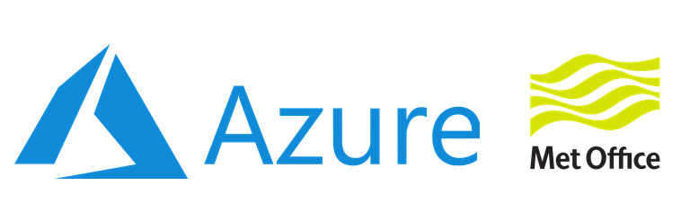

# Grand Challenges 2020

**Welcome to the UKRI EI CDT Grand Challenge 2020 Data and Computational Platform!** 

We are grateful to Microsoft Azure, The Environmental Futures and Big Data Impact Lab and the EU European Regional Development Fund for helping make this possible.

## Overview

This platform is for participants of the Environment Intelligence CDT Grand Challenges 2020. The challenges are:
1. Improvements and inequalities in air quality during the COVID-19 pandemic.
2. Predicting daily average air concentration of pollen grains.
3. Quantifying and communicating uncertainty in dispersion forecasts of radioactive material.
4. Quantifying and communicating uncertainty in volcanic ash forecasts.

In depth brief for each of the challenges can be found in the `ChallengeBriefs` folder.

The Grand Challenges 2020 event aims to:
- To promote an inter-disciplinary approach to using Data Science and AI to find solutions to environmental challenges.
- To provide an opportunity for PhD students to work together using an integrated data-computational platform.

## Updates

Check here for regular updates on the platform, such as the provision of new datasets.

## Quick Start

The Platform is an instance of Pangeo. It provides a JupyterLab environment to work in, which uses Jupyter notebooks as the standard coding environment.

* Learn more about [Pangeo](http://pangeo.io)
* Learn more about [JupyterLab](https://jupyterlab.readthedocs.io/en/stable)
* Learn more about [Jupyter notebooks](https://jupyterlab.readthedocs.io/en/stable/user/notebook.html)

You can also learn more from the example notebooks provided in the `examples_and_docs` folder in your platform homespace.

## The data

Data provided on the platform can be found at `/data`. This folder contains four further folders:

* `met-office`: Contains Met Office Data.
* `share`: this directory can be read and written by all researchers. It is intended for sharing data and research between one-another.

The `share` folder contains the `challenges` folder where all of the data for the four challenges can be found. The four challenge folder are then found at:
* `/data/share/challenges/AQ_Covid`for challenge 1.
* `/data/share/challenges/Pollen` for challenge 2.
* `/data/share/challenges/Fukushima` for challenge 3.
* `/data/share/challenges/VolcanicAsh` for challenge 4.

Each of the folders then contains a `README.txt` (or `PollenSites.txt` for challenge 2) that details the data contained in the folder.  
